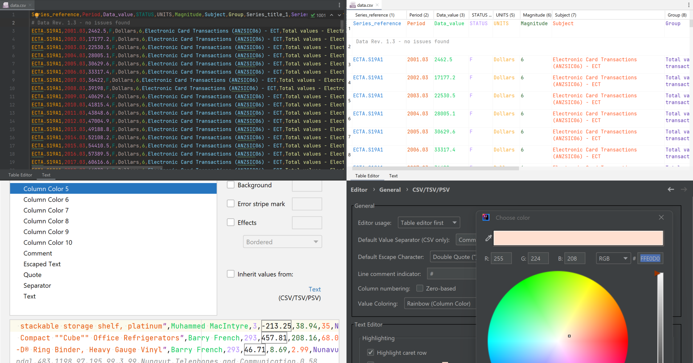
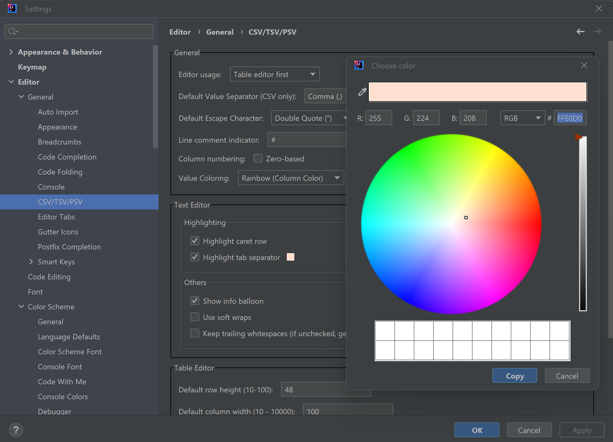

# Release 3

## Goals

- PSI aware table editing
- performance (!)
- fix compatibility issues
- localization? (maybe)


[](https://plugins.jetbrains.com/plugin/10037-csv-plugin)
[](https://github.com/SeeSharpSoft/intellij-csv-validator/actions)
[](https://github.com/SeeSharpSoft/intellij-csv-validator/actions)
[](https://coveralls.io/github/SeeSharpSoft/intellij-csv-validator?branch=master)
[](https://snyk.io/test/github/SeeSharpSoft/intellij-csv-validator?targetFile=build.gradle)
[](https://www.codacy.com/gh/SeeSharpSoft/intellij-csv-validator/dashboard?utm_source=github.com&amp;utm_medium=referral&amp;utm_content=SeeSharpSoft/intellij-csv-validator&amp;utm_campaign=Badge_Grade)
[](https://bettercodehub.com/results/SeeSharpSoft/intellij-csv-validator/)

# Lightweight CSV Plugin for JetBrains IDE family

Compatible with _IntelliJ IDEA  PhpStorm  WebStorm  PyCharm  RubyMine  AppCode  CLion  Gogland  DataGrip  Rider  MPS  Android Studio_ - __2020.1 and newer__

This plugin introduces CSV (_Comma-Separated Values_) as a language to Jetbrains IDE with a syntax definition, structured language elements and associated file types (.csv/.tsv/.psv).
This enables default editor features like syntax validation, highlighting and inspections for CSV-alike files.



## Features

- CSV/TSV/PSV file detection
- flexible Table Editor
- customizable text editor
- customizable column coloring
- customizable line comment
- syntax validation
- syntax highlighting (customizable)
- content formatting (customizable)
- quick fix inspections
- intentions (Alt+Enter), e.g. Quote/Unquote (all), Shift Column Left/Right
- structure view (header-entry layout)
- support for ',', ';', ':', '|' and '&#8633;' as pre-defined value separator
- support for freely defined value separators
- support for line comments (# per default, customizable)
- highlight of active column values
- tab (&#8633;) separator highlighting

(see [full changelog](./CHANGELOG))

**!!Please note!!**

- Starting with **CSV Plugin 2.18.0**, _minimum IntelliJ IDE v2020.1 is required_. Previous versions can be downloaded and installed manually from the following locations: [GitHub Releases](https://github.com/SeeSharpSoft/intellij-csv-validator/releases), [Plugin Repository](https://plugins.jetbrains.com/plugin/10037-csv-plugin/versions) (see also section [Installation](https://github.com/SeeSharpSoft/intellij-csv-validator#installation)).

- Starting with **CSV Plugin 2.14.0**, _Java 11 (55) or higher is required_. Previous versions can be downloaded and installed manually from the following locations: [GitHub Releases](https://github.com/SeeSharpSoft/intellij-csv-validator/releases), [Plugin Repository](https://plugins.jetbrains.com/plugin/10037-csv-plugin/versions) (see also section [Installation](https://github.com/SeeSharpSoft/intellij-csv-validator#installation)).

- Starting with **CSV Plugin 2.11.0**, _Java 9 (53) or higher is required_. Previous versions can be downloaded and installed manually from the following locations: [GitHub Releases](https://github.com/SeeSharpSoft/intellij-csv-validator/releases), [Plugin Repository](https://plugins.jetbrains.com/plugin/10037-csv-plugin/versions) (see also section [Installation](https://github.com/SeeSharpSoft/intellij-csv-validator#installation)).

- Starting with **CSV Plugin 2.10.0**, _new features will only be developed for IntelliJ IDE 2019.3.2 and higher_. ~~I will still release patches for major/critical bugs for previous IDE versions 2017.3.1 - 2019.3.1\*, but no additional features or cosmetic fixes.~~

### Syntax parser & validation

The CSV syntax parser follows the standard defined in [IETF 4180](https://www.ietf.org/rfc/rfc4180.txt) but tolerates leading and trailing whitespaces of escaped text and accepts basically every literal as text data.
This results in a less restrictive checks and contributes to the flexibility of this format.
The goal of the plugin is to support editing files in CSV format, not introducing new hurdles.
 
Being strict, the following CSV snippet is actually incorrect cause of the leading whitespaces. However, it is accepted by the plugins syntax parser implementation:

```
"firstName", "lastName", "birthday"
```
Besides the mentioned diversion from the standard definition, syntax errors will be detected and can be inspected.
Please note that if a document is syntactically incorrect, other features like the table editor, code formatting or the structure view can not function properly.


### Separator

CSV files provide a high degree of flexibility and can be used universally for all kind of data.
This led to a variety of CSV derivatives like semicolon or pipe separated values, which share the common format but make use of a different separator.

The plugin supports file-specific separator settings.
Predefined separators, like Comma (,), semicolon (;), colon (:), tab (&#8633;) and pipe (|), come with a precompiled lexer providing the best performance for working with CSV. 

Since version 2.11.0, this plugin additionally comes with a runtime lexer implementation to support freely chosen separator. 

#### TSV/PSV

A different separator can be chosen for each CSV file. 

Additionally, the file types TSV (Tab-Separated-Values) and PSV (Pipe-Separated-Values) were introduced as a kind of CSV language.
For TSV and PSV files the same formatter and code style settings are applied as for CSV itself, but the separator is considered to be a tab or a pipe respectively.
All functionality that is available for plain CSV files (inspections, intentions, structure view, etc.) can be used for TSV and PSV as well.

### Table Editor 

The plugin provides editing of CSV files via a table editor since version 2.0.0. This editor is NOT related to the _Edit as table..._ functionality of [IntelliJ IDEA Ultimate/PhpStorm/DataGrip/etc.](https://www.jetbrains.com/help/phpstorm/editing-csv-and-tsv-files.html) and does not share any implementation or settings. It is a an alternative to the CSV text editor and not meant to replace or mirror the capabilities of the Jetbrains _"Data"_ tab.

**!!! IMPORTANT !!!**

The table editor requires a syntactically correct formatted CSV file. If the file can't be parsed, the table editor will be not available. The file needs to be fixed first via a text editor before it can be viewed and edited in the table editor.

**Using the table editor might change the format of the CSV file:** Until version 2.1.0 all fields were surrounded by double quotes and any spaces that are not part of the content was removed! Since version 2.1.0 the default changed but the described behavior can still be enabled (see *Editor Settings -> Enforce value quoting*).


#### Undo/Redo

The table editor comes with a custom undo/redo feature (the arrows in the upper right corner) to keep general track of changes to the table (add, remove, edit rows/columns). For text changes within a single cell, the default undo/redo functionality can be used.

#### Context menu

A right-click within the table provides a context menu to add/remove rows, right-click on the table header to add/remove columns.

Please note that the actions within the context menu are meant for the current selection of row(s) and column(s), not necessarily for the cell or header where the context menu appears! A right-click does not trigger a selection change by default.  

#### Key bindings

To support working with the table editor fluently, a set of key bindings are available for manipulating and navigating the table view:

- **_ARROW KEYS_** navigate through the table
- **_ENTER_** start editing current cell (NOTE: mostly any default key triggers an edit)
- **_CTRL+ENTER_** stop editing current cell
- **_CTRL+LEFT_** adds a new column before the current cell
- **_CTRL+RIGHT_** adds a new column after the current cell
- **_CTRL+UP_** adds a new row before the current cell
- **_CTRL+DOWN_** adds a new row after the current cell
- **_CTRL+DELETE/BACKSPACE_** deletes the current selected row(s)
- **_CTRL+SHIFT+DELETE/BACKSPACE_** deletes the current selected column(s)
- **_DELETE/BACKSPACE_** clear content of selected cell(s)

### Editor Settings

- _File > Settings > Editor > General > CSV/TSV Editor_

The plugin introduces an enhanced text editor supporting custom settings - and a table editor. The settings for those can be adjusted in the corresponding CSV/TSV editor settings menu. 



#### General

##### Editor Usage

The preferred editor usage can be switched between "Text Editor first", "Table Editor first" or "Text Editor only", which has an effect on the editor tab order (or whether the table editor is shown at all). A "Table Editor only" option is not available (mainly due to the table editor restrictions when handling erroneous CSV files).

##### Default Value Separator (CSV only)

The following separators are currently supported: **,** (Comma), **;** (Semicolon), **:** (Colon), **|** (Pipe) and **&#8633;** (Tab)

**since 2.15.0:** The default value separator can also be a user defined character sequence.

_Default Value Separator_ defines which separator is used as standard for each newly created or opened CSV file.
The separator character can be changed for each file individually in its editors context menu.

###### Auto Detect

The value separator of a newly opened CSV file can be detected automatically based on the number of predefined separator occurrences.

If _Auto Detect_ is enabled (default), the _Default Value Separator_ setting is only taken into account for newly created files.

**Note:** This option has no effect on TSV/PSV files, the separator is pre-defined by their file- and language-type.

##### Default Escape Character

The following escape characters are currently supported: **"** (Double Quote), **\\** (Backslash)

Within quoted values (fields starting and ending with a double quote), the double quote character must be escaped to be parsed as part of its value and not to be treated as the closing quote. 

_Default Escape Character_ defines which escape character is used as standard for each newly opened CSV/TSV/PSV file. The escape character can be changed for each file individually in its editors context menu.

##### Line Comment Indicator

Define the character(s) that should be used to mark a line as a comment within a CSV document.

**Please note:**

- If not set, comments are disabled, which also will increase lexer/parser performance on large files.
- If a line starts with those characters (leading whitespaces are ignored), the whole line isn't considered data and skipped e.g. for formatting, structure view and the table editor.
- Files containing comments **can't be edited** - but still viewed - via the **Table Editor** (without showing the comments)!

##### Column numbering

Enable zero-based column numbering. This affects the tooltip info of the text editor as well as column numbering of the table editor.

##### Value coloring

Choose the coloring method of values. Possible options are:

- _Rainbow (Column Color)_ - values are colored based on their column.
- _Simple (Text Color)_ - values are colored based on the defined text color.

All colors can be adjusted via [CSV Color Scheme](#color-scheme) settings.

#### Text Editor

##### Highlighting

###### Highlight caret row

The highlighting of the current caret row might interfere with custom background color settings and can be enabled/disabled for CSV/TSV/PSV files here.

###### Highlight tab separator

Enable/disable highlighting (and choose the highlight color) of tab characters (&#8633;) in their role as value separator (TSV). Tabs as part of a value are therefore not highlighted on purpose.

##### Others

###### Show info balloon

Enable/disable the info balloon that appears at the caret position in the text editor.

###### Use soft wraps

Set whether soft wrapping should be activated for CSV/TSV/PSV. It still can be changed file specific with right-click on the editors left outer margin. 

###### Keep trailing whitespaces

If enabled, it overrides the default editor settings for trailing whitespace handling to always keep them when editing CSV/TSV/PSV.

**Note:** This setting has no effect on the table editor. Unquoted values will always be trimmed when opening the table editor. When edited in the table editor, values ending or starting with whitespace will be quoted.

#### Table Editor

##### Text-lines per row (default)

Defines how many lines of text are shown in one editor cell by default. *Auto* does recalculate the height on the fly that can cause some flickering while editing. This setting can be changed in the table editor itself per file.

##### Default column width

The default and initial width of a single table column in _px_.

##### Maximum column width

The maximum width of a single table column in _px_, which is used when adjusting the column widths automatically. 0 deactivates the limitation. This value has no effect when sizing the columns manually in the table editor.

##### Adjust column width on open (default)

If selected, the table column widths are adjusted based on the column contents automatically when the table editor is opened. This setting can be changed in the table editor itself per file. 

##### Header row fixed (default)

If selected, the first record of CSV files will be considered the header per default, which affects the column names in the table editor. This setting can be changed in the table editor itself per file. 

##### Keep/ignore linebreak at file end

If the file ends with a completely empty line (no spaces or tabs either), the table editor will not show this line as empty values but ignore it. When table data is serialized, an existing empty line is kept at the end of the file.

##### Show info panel

Enables/disables the info panel at the bottom of the table editor.

##### Enforce value quoting

Always quotes a single value on save - even if not required.

### Color Scheme

The different symbols of a CSV document, namely the *separator* (e.g. comma, pipe, semicolon), the *quote* character, the *escaped literals* and the *text* elements itself, are colored based on the CSV color scheme settings:

- _File > Settings > Editor > Color Scheme > CSV/TSV/PSV_

Preset colors are based on Jetbrains IDE defaults and support the different UI themes.


#### Column Colors

Besides the colors and font-style variants for the different CSV symbols, additionally up to 10 different column colors can be defined.
Those colors are applied to the columns round robin.
Column colors are taken into account when **Rainbow** is selected as [**Value Coloring**](#value-coloring) option in the [Editor Settings](#editor-settings).


### Formatting

- _File > Settings > Editor > Code Style > CSV_

Formatting CSV is tricky: On one hand it is easy cause the language has only four different symbols and is generally easy to handle.
On the other hand, formatting elements like whitespaces and tabs do have a meaning in CSV.
However, in reality when parsing CSV, the leading and trailing whitespaces are quite often ignored or trimmed.
Formatting can be completely disabled if no option is selected at all at the settings screen.

The formatting is applied to CSV documents as normal code formatting:

- _Code > Reformat code (Ctrl+Alt+L)_


#### Formatting options

The formatting examples are based on the following CSV snippet as input:

```
"name", "city", "position"
Annasusanna,Amsterdam,1
  Ben  ,  Berlin  , 2
```

##### Separator

Adjust spacing around the separator.

_Space before separator_

```
"name" , "city" , "position"
Annasusanna ,Amsterdam ,1
  Ben ,  Berlin , 2
```

_Space after separator_

```
"name", "city", "position"
Annasusanna, Amsterdam, 1
  Ben  , Berlin  , 2
```

##### Trimming

Trimming can be combined with _Space before/after separator_.

_Trim leading whitespaces_

```
"name","city","position"
Annasusanna,Amsterdam,1
Ben  ,Berlin  ,2
```

_Trim trailing whitespaces_

```
"name", "city", "position"
Annasusanna,Amsterdam,1
  Ben,  Berlin, 2
```

##### Tabularize enabled _(default)_

Separator settings can be used in combination with Tabularize enabled, while trimming options are ignored completely.

```
"name     ","city   ","position"
Annasusanna,Amsterdam,1
Ben        ,Berlin   ,2
```

_Trimming/spacing outside quotes_

```
"name"     ,"city"   ,"position"
Annasusanna,Amsterdam,1
Ben        ,Berlin   ,2
```

_Leading whitespaces_

```
"     name","   city","position"
Annasusanna,Amsterdam,         1
        Ben,   Berlin,         2
```

_Trimming/spacing outside quotes & Leading whitespaces_

```
     "name",   "city","position"
Annasusanna,Amsterdam,         1
        Ben,   Berlin,         2
```

### Actions

#### File specific value separator & escape character


The action to switch the value separator (or escape character) - *which is used for CSV syntax validation of a specific file* - is part of its editors context menu.
Since version 2.11.0, also custom separator setting is available via this action.


**Please note:** This action defines how the parser/validator/highlighter/etc. behaves. It does intentionally not change the file content.
To be more precise: It **does not replace** previous separator/escape characters by new ones or adjust the escaped texts.

#### Adjust column widths (table editor only)

Calculates and sets the maximum width for all table columns based on their content. The maximum table column width can be changed via [Editor Settings](#maximum-column-width).  

#### Reset column widths to default (table editor only)

Set the width of all table columns back to default. The default table column width can be changed via [Editor Settings](#default-column-width).

### Inspections

- _File > Settings > Editor > Inspections > CSV_ 

Inspections are an IDE feature that can be used to fix syntax errors.
They are accessed via _Alt+Enter_ when the cursor is at an erroneous position.
The plugin provides three types of inspections:

- **Surround with quotes** Surrounds the current field with quotes and escapes already existing ones
- **Add separator** Adds a (missing) separator at the cursor position
- **Add closing quote** Adds a (missing) closing quote at the end of the document

### Intentions

- _File > Settings > Editor > Intentions > CSV_

Intentions are similar to inspections and provide a quick way to automatically adjust the document.
They are accessed via _Alt+Enter_ at any time. The shown intentions can vary depending on the cursor position within the document. 
The plugin provides six types of intentions:

- **Quote All** Surrounds all unquoted fields with quotes
- **Quote Value** Quotes the currently unquoted value at the cursor position
- **Unquote All** Unquotes all quoted fields if possible
- **Unquote Value** Unquotes the currently quoted value at the cursor position if possible
- **Shift Column Left** Shifts the column at cursor position to the left
- **Shift Column Right** Shifts the column at cursor position to the right

### Structure View

- _View > Tool Windows > Structure_

The structure view shows the first line of the currently opened CSV file as header.
Expanding a header entry shows all entries in this column.


## Installation

Install it from the Jetbrains plugin repository within your IDE (**recommended**):

- _File > Settings > Plugins > Browse repositories... > Search 'CSV Plugin' > Category 'Editor'_

You can also download the JAR package from the [Jetbrains plugin repository](https://plugins.jetbrains.com/plugin/10037-csv-plugin) or from [GitHub Releases](https://github.com/SeeSharpSoft/intellij-csv-validator/releases) and add it manually to your plugins:

- _File > Settings > Plugins > Install plugin from disk..._

## Troubleshooting

#### CSV Plugin causes the IDE to stop working properly

Since version 2.14.0, the plugins requires the IntelliJ platform to be executed on JRE11 or higher. If this is not the case, the following error log can be noticed:

`com.intellij.diagnostic.PluginException: While loading class <className>: <className> has been compiled by a more recent version of the Java Runtime (class file version 55.0), this version of the Java Runtime only recognizes class file versions up to 52.0 [Plugin: net.seesharpsoft.intellij.plugins.csv]`

In some cases the error log doesn't seem to point this out in a noticeable manner, but the IDE doesn't work correctly after enabling the plugin. Always disable the plugin first before continuing with the following steps.

Please read the [official instructions](https://intellij-support.jetbrains.com/hc/en-us/articles/206544879-Selecting-the-JDK-version-the-IDE-will-run-under) on how to switch to a newer JRE, or [manually install](https://github.com/SeeSharpSoft/intellij-csv-validator#installation) a [prior CSV plugin version](https://github.com/SeeSharpSoft/intellij-csv-validator/releases/tag/2.10.0).

#### Features of the CSV Plugin are not available

If another plugin for CSV files like [Rainbow CSV](https://plugins.jetbrains.com/plugin/12896-rainbow-csv) is enabled, this plugin might not be taken into account for parsing and presenting CSV file content. 

## Contribution

Contributions are welcome. Please check [CONTRIBUTING.md](./CONTRIBUTING.md) for more information.

Besides source code contributions, feel free to open bug reports or just suggest new features [here](https://github.com/SeeSharpSoft/intellij-csv-validator/issues).

### Code/feature contributors

- zoom table-editor cells with Ctrl+Mouse Wheel @royqh1979

## Jetbrains Repository

JetBrains Plugin Repository Link: https://plugins.jetbrains.com/plugin/10037-csv-plugin
